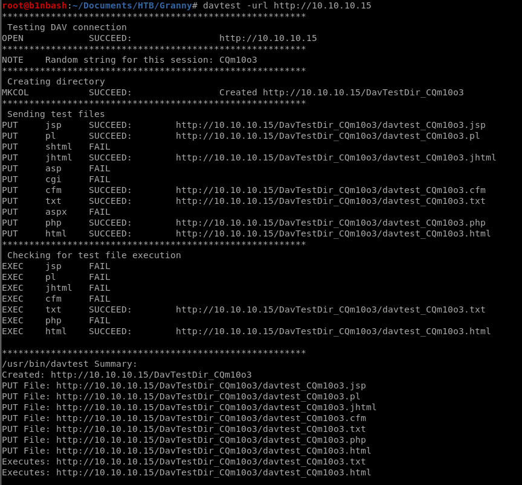

# **Granny - 10.10.10.15**

####  `Granny` is a straight-forward machine I have solved in **HTB**. The IP of the machine is **10.10.10.15**. This machine like most machines in **HTB** comes with lot of new things to learn and also introduced me to an awesome exploit [churrasco.exe](https://github.com/Re4son/Churrasco) and also a 32bit OS compatible [Juicy Potato](https://ivanitlearning.wordpress.com/2019/07/20/potato-privilege-escalation-exploits-for-windows/). This writeup is my attempt in solving Granny without metasploit.


## **1.Enumeration**
As always, let us start enumerating using nmap and checkout which all ports are open and what services, with which version is running on those ports.
### 1.1 nmap

  The following is the result of nmap scan.

``` bash
Starting Nmap 7.80 ( https://nmap.org ) at 2019-11-19 06:14 IST
Nmap scan report for 10.10.10.15 (10.10.10.15)
Host is up (0.19s latency).
Not shown: 65534 filtered ports
Some closed ports may be reported as filtered due to --defeat-rst-ratelimit
PORT   STATE SERVICE VERSION
80/tcp open  http    Microsoft IIS httpd 6.0
| http-methods:
|_  Potentially risky methods: TRACE DELETE COPY MOVE PROPFIND PROPPATCH SEARCH MKCOL LOCK UNLOCK PUT
| http-ntlm-info:
|   Target_Name: GRANNY
|   NetBIOS_Domain_Name: GRANNY
|   NetBIOS_Computer_Name: GRANNY
|   DNS_Domain_Name: granny
|   DNS_Computer_Name: granny
|_  Product_Version: 5.2.3790
|_http-server-header: Microsoft-IIS/6.0
|_http-title: Under Construction
| http-webdav-scan:
|   Public Options: OPTIONS, TRACE, GET, HEAD, DELETE, PUT, POST, COPY, MOVE, MKCOL, PROPFIND, PROPPATCH, LOCK, UNLOCK, SEARCH
|   Allowed Methods: OPTIONS, TRACE, GET, HEAD, DELETE, COPY, MOVE, PROPFIND, PROPPATCH, SEARCH, MKCOL, LOCK, UNLOCK
|   Server Type: Microsoft-IIS/6.0
|   Server Date: Tue, 19 Nov 2019 00:48:01 GMT
|_  WebDAV type: Unknown
Service Info: OS: Windows; CPE: cpe:/o:microsoft:windows

Service detection performed. Please report any incorrect results at https://nmap.org/submit/ .
Nmap done: 1 IP address (1 host up) scanned in 208.07 seconds

```

Here we see that only port 80 is open, running `IIS httpd 6.0`, with `Web Distributed Authoring and Versioning`([WebDAV](https://en.wikipedia.org/wiki/WebDAV)).
Let us open it in browser for further enumeration .

### Port 80:

We access http://10.10.10.15 and we see this.


Well, we could not find anything much in this page. Let us see what all possibilities of exploitation WebDAV is offering us in this machine by running `davtest`.



We see that we can PUT *.html* and *.txt* files easily into the remote server. Since it is IIS 6.0 server it runs files with extention *.aspx*. We also see from results of nmap, that the allowed methods include COPY and MOVE. So, now lets try to manipulate these methods to add our exploit to remote server and check if that effort is fruitful.

To do this we first create a aspx webshell with help of `msfvenom`.


Then we PUT the text file using `cadaver` and use MOVE to change its extention to aspx.


## **2.Exploitation**

Now that we have successfully transfered our exploit to remote server, let us access the file through the browser to execute it to obtain a reverse shell.

Here we access the file in web browser.


And we get a reverse shell.


Let us check our privileges.


We see that we are `nt authority\network service`. Checking the privileges we see `SeImpersonatePrivilege` enabled. I thought I found what I required to privilege escalate.


## **3.Privilege Escalation**

Considering the `SeImpersonatePrivilege` enabled, I went in search of [Juicy Potato Exploit](https://ohpe.it/juicy-potato/) to perform Token Impersonisation attack. But, the machine is a Windows Server 2003 32 bit system. Looking more for 32 bit Juicy Potato, I found [juicypotato32](https://ivanitlearning.wordpress.com/2019/07/20/potato-privilege-escalation-exploits-for-windows/). Well, but I just got disappointed. I could not find an executable there and the exploit seems to be affecting only systems from Windows 7 onwards. **I am not sure why**.

Well, looking more for exploits, I found [churrasco.exe](https://github.com/Re4son/Churrasco). This one is super cool !!!

The syntax is: `churrasco.exe -d "what-you-need-to-execute"`

Again using cadaver I transfered files churrasco.exe and nc.exe to the machine


Traversing to folder containing the files we transfered to remote machine with help of WebDAV we see the following :


Now we run the exploit `churrasco.exe` to get a reverse shell as SYSTEM.


We obatin the reverse shell as SYSTEM and we get the flags :D


## **NOTE**
> I am not sure why Juicy Potato is not applicable to Windows Server 2003. If any of you reading this, gets to know before me, please let me know, I like to learn :).

> If you have any suggestion or feedback, please tweet to me [7axmi](https://twitter.com/7axmi)
